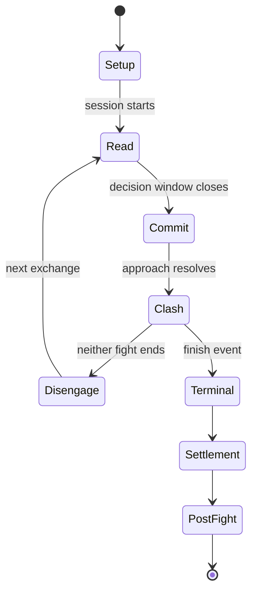
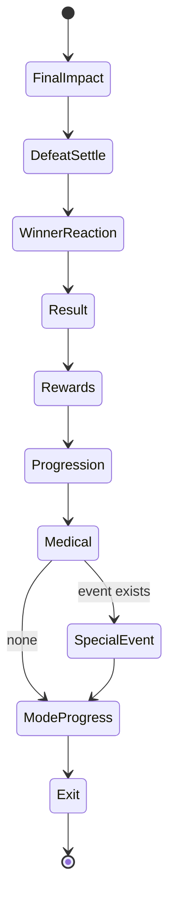

# Rooster Arena Combat System — Canonical Rebuild Specification

> **Status:** CANONICAL  
> **Specification version:** 1.0.0  
> **Architecture revision:** 2026-09-13  
> **Owner:** Combat system  
> **Implementation target:** Production Continuous Combat V2  
> **Authority:** This document is the root contract for all combat behavior, integrations, UI, animation, persistence, rewards, injuries, progression, and testing.

---

## 0. Canonical authority and supersession

This document is the single source of truth for the production combat system.

Every other active combat document must:

1. Link to this document.
2. Declare the section of this document it expands.
3. Avoid redefining any invariant, command, phase, result, authority rule, or persistence rule defined here.
4. Be treated as subordinate when it conflicts with this document.

All earlier combat proposals—including legacy simulator specifications, continuous-combat drafts, strategy-fighter proposals, tell-system drafts, post-fight drafts, animation notes, and mode-specific battle-flow documents—are superseded wherever they conflict with this specification.

Add this header to retained supporting documents:

```md
Status: SUPPORTING
Canonical parent: docs/combat/COMBAT-CANONICAL.md
Scope: <exact section expanded by this document>
If this document conflicts with the canonical specification, the canonical specification wins.
```

Add this header to obsolete documents:

```md
Status: ARCHIVED
Do not implement against this document.
Superseded by: docs/combat/COMBAT-CANONICAL.md
```

### 0.1 Fixed decisions

The following decisions are final for this rebuild unless this canonical document is deliberately versioned:

| Decision | Canonical rule |
| --- | --- |
| Combat generation | Continuous Combat V2 is the only production combat engine. |
| Authority | The server owns simulation, commands, outcomes, and settlement. |
| Visible fight | The client renders the authoritative event stream; it never resimulates a production outcome. |
| Commands | Exactly four: `PRESS`, `WAIT`, `COUNTER`, `RECOVER`. |
| Command timing | Freely changeable in the readable phase; locked at commitment. |
| Command points | Removed. They are not part of canonical combat. |
| Tells | Physical, diegetic, movement-named, and attached to the relevant fighter. |
| Modes | Normal, PvE, boss, tournament, and future PvP use the same session contract. |
| Opponents | Resolved from server-owned encounter records or snapshots, never trusted client objects. |
| Settlement | Transactional, idempotent, and produced once from the authoritative terminal result. |
| Draws | Valid outcomes. `winnerId: null` must remain null. |
| Critical injuries | Can immediately stop combat at the event that caused them. |
| Post-fight | An event-driven state machine, not a chain of arbitrary timers. |
| Legacy simulator | May remain temporarily for migrations or historical tests but cannot power, validate, or settle production combat. |

---

## 1. Product definition

Rooster Arena combat is a continuous, server-authoritative strategy fighter. The roosters move and fight autonomously according to physical attributes, trained stats, condition, personality, style, and current mental state. The player acts as the coach: read an opponent's physical behavior during stalking, issue a concise instruction, and live with how the rooster interprets and executes it.

The player does not directly trigger individual pecks, kicks, jumps, or dodges. The strategy is selecting the right intent at the right time while managing risk, fatigue, position, momentum, and the rooster's imperfect compliance.

The essential experience is:

> Watch the fighters, read a physical tell, choose one of four coaching instructions before commitment, then see that instruction materially shape the same authoritative clash that determines the real result.

### 1.1 Product pillars

1. **One watched fight, one real result.** The visible sequence and persisted result can never come from separate simulations.
2. **Read the rooster, not a dashboard.** Essential tells and command feedback stay near the action.
3. **Meaningful coaching without puppeteering.** Commands strongly bias decisions but do not erase genetics, training, behavior, stress, or uncertainty.
4. **Fast clashes, readable spaces.** Stalking provides thought; commitment creates tension; clashes are brief and explosive; disengagement makes the next read possible.
5. **Physical consequences.** Health, balance, condition, fatigue, injuries, morale, and career damage have different jobs and remain legible.
6. **Deterministic enough to trust.** The same versioned input, seed, and command log reproduces the same semantic fight.
7. **One combat contract across modes.** Game modes configure combat; they do not invent alternate engines.

### 1.2 Non-goals for this rebuild

The following are not required to complete the core rebuild:

- Direct action-game controls.
- Per-frame server physics streaming.
- Real-time human-versus-human networking.
- Spectator infrastructure.
- Persistent public replay archives.
- Equipment loadouts or power-up systems.
- Deep opponent scouting, conditional game-plan scripting, drafts, seasons, contracts, or gauntlets.
- A complete rewrite of the existing V2 engine solely for architectural cleanliness.

The rebuild must preserve useful V2 simulation, genetics, physical profiles, tells, animation assets, career systems, and presentation code where they satisfy this contract.

---

## 2. Non-negotiable invariants

These invariants are release blockers.

### INV-01 — A production fight has exactly one authoritative simulation

The server session that accepts commands must also generate the event log, terminal result, injuries, rewards, records, traits, awakening progress, tournament advancement, and all other consequences.

### INV-02 — The client is a renderer and input device

The production client may interpolate movement, blend animation, position cameras, play audio, emit particles, and add seeded cosmetic variation. It must not decide hits, damage, tells, compliance, injuries, winner, finish reason, rewards, or progression.

### INV-03 — Commands affect the authoritative future only

A valid command is applied to the same unresolved server simulation the player is watching. A command cannot rewrite already-emitted events. Rejected or late commands cannot silently appear successful.

### INV-04 — Server-owned combatants

The client sends identifiers and allowed configuration only. It cannot provide trusted stats, opponent records, physical profiles, traits, rewards, injury state, or snapshots.

### INV-05 — Settlement occurs at most once

Retries, refreshes, duplicate requests, multiple tabs, race conditions, stream reconnects, and server failures cannot duplicate rewards or progression.

### INV-06 — Terminal outcomes are lossless

`winnerId`, draw status, double KO, medical stoppage, timeout/decision, and the originating engine finish reason must survive adapters and persistence without invented fallbacks.

### INV-07 — Semantic determinism

Given the same engine version, ruleset version, starting snapshots, seed, and accepted command log, the semantic event log and terminal result must match exactly.

### INV-08 — All production modes use the same core

Normal battles, campaign encounters, bosses, side encounters, and tournaments must create the same kind of combat session and render its authoritative events. Mode adapters may change eligibility, opponent source, ruleset, rewards, presentation, and post-fight destinations—not combat authority.

### INV-09 — No fabricated information

Unknown opponent history, records, rankings, injuries, or scouting information must be hidden or labeled unknown. UI code must never invent plausible values.

### INV-10 — Gameplay and presentation clocks are separate

Server logical time decides gameplay. Client animation time decides how authoritative events are displayed. Hit-stop, slow motion, dropped frames, tab suspension, and replay speed cannot change the result.

---

## 3. Canonical combat lifecycle



### 3.1 Session-level states

| State | Meaning | Allowed mutations |
| --- | --- | --- |
| `CREATED` | Session and immutable snapshots exist but simulation has not begun. | Start or cancel before consumption. |
| `ACTIVE` | Simulation is progressing through exchanges. | Sync, accept eligible command, expire, or finish. |
| `TERMINAL_UNSETTLED` | A terminal result exists and no more gameplay is allowed. | Attempt settlement only. |
| `SETTLED` | Consequences were committed exactly once. | Read/reconnect only. |
| `EXPIRED` | Session exceeded its allowed lifetime before a valid terminal result. | Read expiry response; optionally create a replacement under mode rules. |
| `VOIDED` | Administrative or integrity failure made the session non-settleable. | Read reason only. No rewards or records. |

Deleting an in-memory object is never a valid state transition. Durable session identity and terminal responses must outlive process memory.

### 3.2 Exchange phases

Each exchange uses the following phase order:

1. `READ`
2. `COMMIT`
3. `APPROACH`
4. `CLASH`
5. `DISENGAGE`
6. next `READ`, or `TERMINAL`

#### `READ`

The fighters circle, stalk, reset distance, test angles, and expose readable physical behavior. The player can issue or replace an instruction throughout this phase. The current instruction is visible. At least one meaningful opponent cue must have enough screen time to be perceived at normal speed.

Canonical target duration: **2.2–5.0 seconds**, varied deterministically by temperament, fatigue, confidence, prior exchange, distance, and mode pacing. Accessibility settings may slow presentation but not extend the authoritative deadline in competitive modes. PvE may optionally use an explicit tactical slow mode if the ruleset grants it.

#### `COMMIT`

The opponent crosses the commitment boundary. The tell resolves into intent. The active player command is atomically locked. New commands are rejected with `COMMAND_LOCKED`; they are not queued for the current exchange.

Canonical target duration: **0.25–0.70 seconds**.

#### `APPROACH`

The fighters close distance through a dash, measured step, lateral entry, jump, feint continuation, or forced engagement. No new command affects the current exchange.

Canonical target duration: **0.25–0.90 seconds**, distance-dependent.

#### `CLASH`

The engine resolves a compact sequence of one or more attack, defense, evasion, counter, impact, balance, and injury events. A clash is not required to be one attack. It should normally feel like a fast burst.

Canonical target duration: **0.7–2.4 seconds of normal presentation**, excluding bounded cinematic emphasis.

#### `DISENGAGE`

The fighters separate, land, recover footing, and establish new distance. Disengagement is skipped if a terminal event already occurred.

Canonical target duration: **0.6–1.8 seconds**.

### 3.3 Command persistence across exchanges

An instruction is a coaching stance, not a single-use ability. The most recently accepted command remains active at the beginning of the next `READ` phase until the player changes it. This prevents network latency or divided attention from turning a missed click into an unexplained null action.

The HUD must distinguish:

- **Selected:** locally highlighted while a request is pending.
- **Accepted:** acknowledged by the server and eligible to become active.
- **Locked:** the instruction used for the current exchange.
- **Executed:** the rooster's resolved behavior and compliance grade.

---

## 4. Coaching model

### 4.1 Canonical commands

There are exactly four player commands.

| Command | Coaching meaning | Primary benefits | Primary risks |
| --- | --- | --- | --- |
| `PRESS` | Take space, close decisively, and keep the opponent under pressure. | Initiative, engagement chance, offensive volume, punishment of exposed recovery. | Greater commitment, fatigue, and counter vulnerability. |
| `WAIT` | Hold structure, keep distance, and make the opponent reveal more. | Stability, information quality, reduced overcommitment, safe control against premature counters. | Can concede initiative and permit recovery; repeated passivity triggers inactivity handling. |
| `COUNTER` | Invite commitment, evade or absorb efficiently, then answer. | Punishes readable pressure, improves counter timing and efficient damage. | Can be stranded by patience, feints, lateral entries, or another counter posture. |
| `RECOVER` | Disengage, breathe, restore footing, and reduce immediate output. | Stamina recovery, composure, balance restoration, stress control. | Vulnerable to pressure and may surrender position or momentum. |

The relationship is contextual, not a hard four-way rock-paper-scissors table. As a baseline:

- `COUNTER` tends to punish predictable `PRESS`.
- `PRESS` tends to punish exposed `RECOVER`.
- `WAIT` tends to deny or outlast premature `COUNTER`.
- `RECOVER` is safest when the opponent is cautious, off-balance, disengaging, or unable to pressure.
- Stats, distance, tell accuracy, action selection, style, fatigue, injuries, confidence, and compliance can overturn these tendencies.

### 4.2 No command points or cooldown resource

There is no command-point meter, regeneration clock, coaching cooldown, or arbitrary delay between instruction changes.

The decision window is the resource:

```text
READ: freely revise instruction
COMMIT: instruction locks
APPROACH / CLASH / DISENGAGE: current exchange cannot be changed
NEXT READ: freely revise again
```

The server may rate-limit abusive HTTP traffic, but transport throttling must not become a hidden gameplay cooldown. The last valid command received before commitment wins.

### 4.3 Command influence and imperfect compliance

Commands must matter without granting direct control. Resolution occurs in two layers:

1. **Interpretation:** determine how strongly the fighter understands and accepts the command.
2. **Execution:** choose legal physical actions biased by that interpretation and the current situation.

Canonical compliance grades:

| Grade | Meaning | Required feedback |
| --- | --- | --- |
| `FULL` | Behavior closely follows the command. | Clear command-colored intent feedback. |
| `PARTIAL` | The fighter follows the goal but chooses a safer or imperfect action. | Brief reason, such as hesitation or poor angle. |
| `RESISTED` | Innate behavior or mental state substantially overrides the instruction. | Explicit refusal/instinct feedback; never silent. |
| `IMPOSSIBLE` | The intended behavior was physically unavailable due to range, balance, injury, stamina, or state. | Concrete physical reason. |

Compliance may be influenced by:

- Temperament and genetic style.
- Familiarity, experience, and coaching-related traits.
- Confidence, stress, morale, and mental state.
- Fatigue, condition, pain, active injuries, and balance.
- Whether the instruction fits the fighter's natural style.
- Whether an executable action exists from the current position.

Compliance must never be a flat arbitrary miss chance. The event log must retain the factors that materially produced `PARTIAL`, `RESISTED`, or `IMPOSSIBLE` for debugging and player feedback.

### 4.4 Manual and Auto-Coach

Every session declares one coaching mode:

- `MANUAL`: the player controls the four instructions.
- `AUTO`: server-side Auto-Coach selects instructions from the same authoritative state available under the ruleset.

Auto-Coach is not a separate simulator and may not read hidden future RNG or unrevealed intent. It consumes the same current tell certainty, visible state, and fighter information allowed to the player. Auto-Coach commands are recorded in the same command log with `source: AUTO_COACH`.

Manual sessions use a selected opening instruction. If the player does nothing in a later read window, the last accepted instruction persists. If a disconnected client remains absent, mode policy may continue with that instruction or switch to Auto-Coach after a declared grace period. The choice must be stored in the session ruleset and shown before the fight.

### 4.5 Minimal pre-fight configuration

Before creating the session, the player chooses:

1. Coaching mode: `MANUAL` or `AUTO`.
2. Opening instruction: one of the four canonical commands.
3. Disconnect fallback where the mode permits it: `KEEP_INSTRUCTION` or `AUTO_COACH`.

The matchup screen must not add undocumented strategy controls that alter simulation. Future presets must compile into these canonical inputs or receive a versioned extension to this specification.

### 4.6 Keyboard controls

The default hotkeys are:

| Key | Command |
| --- | --- |
| `1` | `PRESS` |
| `2` | `WAIT` |
| `3` | `COUNTER` |
| `4` | `RECOVER` |

Buttons and hotkeys call the same command function, display the same pending/accepted/locked states, and respect focus safety. Hotkeys must not fire while the user is typing in an editable field or while a blocking overlay owns input. Key bindings must be remappable later without changing the engine command enum.

---

## 5. Tells and the decision interface

### 5.1 Tell contract

A tell is a server-selected, physically represented clue about likely near-future behavior. It is not a command recommendation and does not guarantee one exact attack.

Each authoritative tell contains:

```ts
type CombatTell = {
  id: string;
  fighterId: string;
  exchangeIndex: number;
  family: TellFamily;
  displayName: string;
  intensity: "SUBTLE" | "CLEAR" | "URGENT";
  reliability: number;       // internal or ruleset-gated; 0..1
  startsAtTick: number;
  commitsAtTick: number;
  anatomyCues: AnatomyCue[];
  audioCue?: AudioCue;
  isFeint: boolean;
};
```

Tell selection, reliability, and feints are authoritative gameplay. Anatomy blending, particles, label easing, and audio mixing are presentation.

### 5.2 Canonical tell vocabulary

Tell names describe visible movement, not the correct answer.

| Family | Display name | Physical animation contract | Likely tactical meaning, never shown as certainty |
| --- | --- | --- | --- |
| `FORWARD_LOAD` | **Weight Forward** | Chest and root shift forward; neck projects; toes grip; tail counterbalances. | Closing pressure, forward burst, or committed entry. |
| `LOW_LINE_LOAD` | **Head Low** | Head drops below neutral; neck compresses; gaze remains fixed; body stays ready. | Low-line dart, peck entry, or bait into a rising action. |
| `REAR_LOAD` | **Rear Foot Set** | Rear leg plants; hips settle; front foot lightens; wings tense. | Jump, kick, explosive lunge, or planted counter. |
| `WING_LOAD` | **Wing Open** | One or both wings separate from body; shoulder joint loads; stance widens. | Aerial burst, wing-assisted clash, balance correction, or intimidation feint. |
| `BACK_LOAD` | **Weight Back** | Center of mass shifts rearward; neck retracts; front line opens. | Evasion, counter posture, retreat, or recovery preparation. |
| `LATERAL_LOAD` | **Side Step** | Lead foot crosses or opens; torso yaws; head stays tracked on target. | Angle change, flank entry, sidestep, or escape lane. |
| `BREATH_LOAD` | **Chest Rising** | Chest visibly expands; beak may open; stance avoids commitment; wing tension reduces. | Stamina recovery, hesitation, stress control, or deceptive pause. |
| `BALANCE_LOAD` | **Feet Resetting** | Short foot adjustments; tail and wings stabilize; head bob slows. | Balance recovery, delayed entry, or preparation to re-engage. |

Supporting specs may add animation variants inside these families. Adding a new player-visible tell family requires updating this document, usability testing, and a migration note. Do not create a new label for every attack animation.

### 5.3 Tell readability rules

1. Show one primary readable tell for the relevant opponent during a normal read window.
2. A secondary tell may appear only when it clarifies a compound physical action and does not create label overload.
3. The physical motion begins before the text/symbol reaches full emphasis.
4. The tell persists long enough to be perceived, interpreted, and answered under target hardware conditions.
5. Feints use the same vocabulary and are earned through stats, styles, or traits—not random label lies.
6. Stronger scouting/read ability may reveal a cue earlier, increase clarity, or reduce ambiguity. It must not display “press COUNTER now.”
7. Tells must remain understandable with labels disabled once the player has learned the system.

### 5.4 Spatial HUD placement

The primary tell is anchored above or immediately beside the opponent rooster in screen space. It follows a stable projected anchor such as upper chest/head midpoint, with smoothing and edge clamping.

The player should be able to watch the opponent, perceive the tell, and see their own accepted command without shifting focus to a distant side panel.

Required hierarchy:

1. Opponent physical cue.
2. Small near-fighter tell label/icon.
3. Player command controls near the lower combat area.
4. Detailed explanation or history only in an optional peripheral panel.

World-space text must remain readable against bright and dark backgrounds, avoid covering the rooster's head, and never scale into a giant billboard during camera zoom.

### 5.5 Accessibility

The system must not rely on color alone. Each tell uses motion plus a distinct silhouette/icon and optional label. Each accepted command uses text, shape, and audio/haptic feedback where available.

Required options:

- Tell labels on/off.
- Reduced camera motion.
- Reduced hit flash.
- Separate VFX and UI intensity.
- High-contrast cues.
- Independent combat cue volume.
- Input remapping when the general settings system supports it.

---

## 6. Authoritative architecture

### 6.1 Target flow

```text
Server validates encounter and fighter eligibility
  -> creates immutable combat snapshots and versioned session
  -> advances V2 simulation to the first READ phase
  -> emits authoritative state/events/tell/deadline
Client renders events and sends commands
  -> server advances logical simulation to command receipt time
  -> accepts the last eligible command before COMMIT
  -> server resolves COMMIT, APPROACH, CLASH, and consequences
  -> client renders emitted events in order
Repeat until terminal
  -> server settles atomically and idempotently
  -> client runs event-driven post-fight presentation from settled payload
```

### 6.2 Simulation granularity

The authoritative engine is a semantic simulation, not a video-frame simulator. It owns ticks, phases, action selection, collisions/hit outcomes at gameplay resolution, damage, balance, stamina, tells, and terminal conditions.

The client owns skeletal interpolation and choreography between semantic events. For example, the server can emit `APPROACH_STARTED`, `ATTACK_STARTED`, `EVADE`, `HIT`, `KNOCKDOWN`, and `DISENGAGE_TARGET`; the client turns these into smooth animation without changing their order or outcome.

### 6.3 Serverless-safe advancement

The engine must not depend on one immortal Node.js process. A session advances when an authorized sync, command, or runner operation occurs:

1. Lock or compare-and-swap the session revision.
2. Compute authoritative elapsed logical time from server timestamps and session policy.
3. Advance through every due semantic boundary.
4. Append resulting events and update the checkpoint atomically.
5. Apply an eligible command only after advancement to its server receipt time.
6. If terminal, transition to settlement.

If no client is connected, logical time still advances. On reconnection, the server fast-forwards all due boundaries. The disconnect policy determines whether the last instruction persists or Auto-Coach takes over. Client clocks are never trusted.

### 6.4 Source modules

Production entry points must converge on one domain service, conceptually:

```ts
interface CombatService {
  createSession(input: CreateCombatSessionInput, actor: AuthenticatedActor): Promise<CombatView>;
  syncSession(sessionId: string, actor: AuthenticatedActor): Promise<CombatDelta>;
  issueCommand(sessionId: string, input: IssueCommandInput, actor: AuthenticatedActor): Promise<CommandReceipt>;
  getSession(sessionId: string, actor: AuthenticatedActor, afterCursor?: number): Promise<CombatView>;
}
```

Routes may be mode-specific before creation, but once created they must call the same combat service and V2 session implementation.

### 6.5 ContinuousBattle responsibility

`ContinuousBattle` becomes an authoritative event player.

It may:

- Fetch session state and event deltas.
- Submit command requests.
- Project semantic events into animation state.
- Smooth server positions.
- Buffer a small amount for stable playback.
- Play camera, sound, VFX, UI, hit-stop, and reactions.
- Reconnect by event cursor.
- Run post-fight presentation from the settled payload.

It may not:

- Instantiate a result-producing local combat simulation in production modes.
- Roll hit, dodge, critical, injury, compliance, tell, or winner RNG.
- Alter health or state except by applying authoritative events.
- Submit or display a locally invented terminal result.
- Settle rewards.

A separate sandbox/dev simulator may exist behind an explicit development boundary. It must be visually labeled non-authoritative and cannot call production settlement.

---

## 7. Session and data model

Names may be adapted to the existing schema, but the following semantics are required.

### 7.1 Battle session

```ts
type BattleSessionRecord = {
  id: string;
  ownerPlayerId: string;
  mode: "NORMAL" | "PVE" | "BOSS" | "SIDE_ENCOUNTER" | "TOURNAMENT" | "PVP";
  modeContextId: string | null;
  encounterId: string;

  engineVersion: string;
  rulesetVersion: string;
  snapshotSchemaVersion: string;
  seed: string;

  fighterASnapshot: CombatantSnapshot;
  fighterBSnapshot: CombatantSnapshot;

  coachingMode: "MANUAL" | "AUTO";
  disconnectPolicy: "KEEP_INSTRUCTION" | "AUTO_COACH";
  activeCommand: CoachingCommand;

  status: BattleSessionStatus;
  phase: CombatPhase | null;
  exchangeIndex: number;
  logicalTick: number;
  revision: number;
  latestEventCursor: number;
  engineCheckpoint: VersionedEngineCheckpoint;

  createdAt: string;
  startedAt: string | null;
  lastAdvancedAt: string | null;
  expiresAt: string;
  terminalAt: string | null;
  settledAt: string | null;

  terminalResult: AuthoritativeCombatResult | null;
  settlementKey: string;
  voidReason: string | null;
};
```

### 7.2 Immutable combatant snapshot

The session snapshot contains every gameplay input needed for replay and must not read mutable fighter rows mid-fight.

```ts
type CombatantSnapshot = {
  fighterId: string;
  ownerPlayerId: string | null;
  displayName: string;
  sourceRevision: number;

  ivs: CombatStats;
  evs: CombatStats;
  derivedStats: EffectiveCombatStats;
  physicalProfile: PhysicalProfile;
  style: FighterStyle;
  traits: VersionedTraitSnapshot[];
  mutations: VersionedMutationSnapshot[];

  maxHealth: number;
  startingHealth: number;
  startingEnergy: number;
  startingCondition: number;
  startingTrainingFatigue: number;
  startingStress: number;
  startingMorale: number;
  startingConfidence: number;

  activeInjuries: CombatInjurySnapshot[];
  permanentModifiers: PermanentCombatModifier[];
  careerState: CareerCombatSnapshot;
};
```

Snapshots must be generated by server domain code from persisted records, encounter templates, or verified server-generated AI fighters.

### 7.3 Encounter ownership

The client starts a fight with an `encounterId`, not an opponent object.

An encounter record or signed server ticket determines:

- Opponent identity/template and snapshot source.
- Allowed player fighter(s).
- Mode and mode context.
- Ruleset and reward table.
- Expiry and replay policy.
- Whether the encounter has already been consumed.
- Any tournament bracket, campaign node, or boss progression binding.

The server revalidates ownership, eligibility, fighter status, energy/condition rules, and encounter consumption while creating the session.

### 7.4 Event envelope

```ts
type CombatEvent<T extends CombatEventType = CombatEventType> = {
  id: string;                 // deterministic from session + cursor
  sessionId: string;
  cursor: number;             // strictly increasing
  logicalTick: number;
  exchangeIndex: number;
  type: T;
  payload: CombatEventPayloadMap[T];
  semantic: true;
};
```

Wall-clock creation timestamps may exist in storage metadata but cannot participate in deterministic result equality.

### 7.5 Required semantic event families

- Session: `SESSION_STARTED`, `PHASE_CHANGED`, `SESSION_TERMINAL`, `SESSION_SETTLED`.
- Coaching: `COMMAND_ACCEPTED`, `COMMAND_LOCKED`, `COMMAND_RESOLVED`, `AUTO_COMMAND_SELECTED`.
- Tells: `TELL_STARTED`, `TELL_INTENSIFIED`, `TELL_COMMITTED`, `TELL_REVEALED`.
- Movement: `STANCE_CHANGED`, `CIRCLE_TARGET`, `APPROACH_STARTED`, `DISENGAGE_TARGET`.
- Actions: `ACTION_STARTED`, `ACTION_CHAINED`, `ACTION_ENDED`.
- Defense: `BLOCK`, `EVADE`, `COUNTER_WINDOW`, `COUNTER_TRIGGERED`.
- Impacts: `HIT`, `CRITICAL_HIT`, `STAGGER`, `KNOCKBACK`, `KNOCKDOWN`, `GET_UP`.
- Resources: `HEALTH_CHANGED`, `STAMINA_CHANGED`, `BALANCE_CHANGED`, `COMBAT_MOMENTUM_CHANGED`.
- Psychology: `MENTAL_STATE_CHANGED`, `COMPOSURE_CHANGED`, `STRESS_CHANGED`.
- Medical: `INJURY_SUSTAINED`, `MEDICAL_STOPPAGE`.
- Terminal: `KNOCKOUT`, `DOUBLE_KO`, `TIME_LIMIT_REACHED`, `DECISION_SCORED`.

Supporting event types may be added without changing the product model, but events that decide gameplay must be semantic and server-generated.

---

## 8. API contract

Exact route placement may follow the app's conventions. The behavior is canonical.

### 8.1 Create a session

`POST /api/combat/sessions`

```json
{
  "fighterId": "fighter_123",
  "encounterId": "encounter_456",
  "coachingMode": "MANUAL",
  "openingCommand": "WAIT",
  "disconnectPolicy": "KEEP_INSTRUCTION"
}
```

The client must not send an opponent snapshot, stats, rewards, seed, ruleset, health, record, or injury data.

The response contains session identity, server time, current revision, phase/deadline, public fighter views, event cursor, initial events, and allowed player actions.

Creation requires an idempotency key. Retrying the same creation request returns the same session or the same terminal error.

### 8.2 Read/reconnect

`GET /api/combat/sessions/:sessionId?after=<cursor>`

Returns the current projection and all retained events after the cursor. Reading does not accept client-authored state. If the implementation advances on access, it must do so through the same locked domain operation used by sync, never ad hoc route logic.

### 8.3 Sync/advance

`POST /api/combat/sessions/:sessionId/sync`

```json
{
  "afterCursor": 128,
  "observedRevision": 42
}
```

The server advances to authoritative receipt time, persists the new checkpoint and events, and returns a delta. A background runner or stream transport may call the same operation. The client does not supply delta time or target tick.

### 8.4 Issue a command

`POST /api/combat/sessions/:sessionId/commands`

```json
{
  "commandId": "client_uuid",
  "command": "COUNTER",
  "observedRevision": 42
}
```

Processing order:

1. Authenticate player and authorize session ownership.
2. Deduplicate `commandId`.
3. Lock/load the session.
4. Advance simulation to server receipt time.
5. Check that the resulting phase accepts commands.
6. Store and emit the accepted command.
7. Increment revision and commit atomically.

Success:

```json
{
  "status": "ACCEPTED",
  "commandId": "client_uuid",
  "command": "COUNTER",
  "revision": 43,
  "acceptedAtTick": 804,
  "eligibleExchangeIndex": 3
}
```

Canonical rejection codes:

- `COMMAND_LOCKED`
- `SESSION_TERMINAL`
- `SESSION_EXPIRED`
- `SESSION_NOT_OWNED`
- `INVALID_COMMAND`
- `STALE_SESSION` when safe automatic reconciliation is impossible
- `RATE_LIMITED` for transport abuse only

A rejected command must immediately reconcile the UI to the last server-accepted command.

### 8.5 Event delivery

Polling is acceptable for the first integration if it preserves order and responsiveness. SSE or WebSocket may later reduce latency. Regardless of transport:

- Events are ordered by cursor.
- Reconnect begins after the last applied cursor.
- Duplicate events are harmless.
- Gaps trigger resync.
- No gameplay semantics exist only in an ephemeral socket message.
- Terminal result and settlement remain readable after reconnect.

### 8.6 No client settlement endpoint

The client does not tell the server who won and does not submit calculated rewards. Settlement is automatically attempted when the authoritative session becomes terminal. A private/admin retry operation may exist for failed settlement, keyed to the existing terminal result.

---

## 9. Combat state model

### 9.1 Distinct state variables

The following must not be collapsed into misleading aliases:

| Variable | Meaning |
| --- | --- |
| `health` | Capacity to continue after accumulated damage. |
| `stamina` | Short-term ability to produce and sustain action during the fight. |
| `balance` | Immediate physical stability and footing. |
| `combatMomentum` | Tactical swing and initiative pressure between fighters. |
| `condition` | Pre-fight readiness and recovery quality. |
| `trainingFatigue` | Persistent fatigue brought into the fight. |
| `stress` | Psychological strain. |
| `morale` | Broader willingness and resilience. |
| `confidence` | Current belief/commitment affecting decisions. |
| `mentalState` | A derived, hysteresis-controlled combat state. |

Physical `balance` must never be labeled momentum. Animation state must never be labeled mental state.

### 9.2 Effective stats

All modes and the V2 engine use one versioned effective-stat calculator. No route or UI may maintain its own competing formula.

Conceptually:

```text
base trained stat
  = combine(IV, EV, growth stage, training rules)

effective combat stat
  = base trained stat
  × physical-profile modifier
  × trait/mutation modifier
  × permanent-injury modifier
  × condition/fatigue modifier
  × current combat-state modifier
```

Each modifier category is applied once. The exact coefficients belong in a versioned balance configuration validated by snapshot tests. Permanent injury penalties calculated by the career system must feed this pipeline rather than existing only in clinic UI.

### 9.3 Physical profile integration

The physical genome and derived profile must materially affect combat:

- `mass`: impact, resistance to knockback, stamina cost, and health scaling within bounded limits.
- `reach`: attack eligibility, approach distance, and first-contact advantage.
- `mobility`: circling, closing, disengagement, lateral evasion, and angle creation.
- `stability`: balance loss, stagger, knockdown resistance, and planted strikes.
- `wingControl`: aerial entry, landing stability, wing-assisted attacks, and recovery.
- `kickPower`: eligible kicking impact, not universal damage.

Physical advantages require costs or matchup dependencies. A larger fighter cannot receive free health, damage, stability, and reach without stamina/mobility tradeoffs.

### 9.4 Combat momentum

`combatMomentum` is a bounded tactical swing, recommended range `-100..100` from fighter A's perspective. It changes gradually from meaningful events:

- Clean hits and successful counters.
- Forced retreats or dominant positioning.
- Staggers and knockdowns.
- Failed overcommitments.
- Successful recovery under pressure.
- Repeated initiative without meaningful damage, at a reduced weight.

Momentum is a nudge, not a comeback script. It may bias confidence, action selection, initiative, tell intensity, and crowd/presentation energy. It must not directly award unexplained damage or force an outcome.

### 9.5 Mental state

Canonical states:

- `CALM`
- `CONFIDENT`
- `NERVOUS`
- `FRUSTRATED`
- `DESPERATE`
- `EXHAUSTED`

Mental state is derived from health, stamina, stress, confidence, momentum, recent events, temperament, and traits. Use hysteresis and minimum dwell time to prevent rapid flicker.

Example effects:

| State | Typical bias |
| --- | --- |
| `CALM` | Stable compliance and read quality. |
| `CONFIDENT` | Faster commitment and stronger pressure, with mild overcommit risk. |
| `NERVOUS` | Hesitation, defensive choices, reduced commitment. |
| `FRUSTRATED` | Forced entries, lower feint discipline, weaker command fit. |
| `DESPERATE` | High-risk action selection and reduced self-preservation. |
| `EXHAUSTED` | Slower approach, poor recovery, restricted action library. |

The UI shows a mental-state change only when it is player-relevant. It must not continuously expose hidden numeric internals.

### 9.6 Inactivity and forced engagement

Counter-versus-counter and repeated waiting cannot create an endless evasion loop.

Track inactivity using meaningful engagement, damage, initiative changes, and elapsed exchanges. When the threshold is reached, the engine emits `FORCE_ENGAGEMENT_WARNING`. If inactivity continues, it applies a deterministic engagement pressure rule that narrows distance and raises commitment likelihood for both fighters.

Forced engagement:

- Is a simulation rule, not a hidden teleport.
- Preserves stats and action legality.
- Does not guarantee a hit.
- Is logged as an authoritative event.
- Resets after meaningful engagement.

Recommended initial threshold: warning after two non-engaging exchanges, forced engagement on the next eligible exchange. Balance configuration may tune this with tests.

---

## 10. Action and clash resolution

### 10.1 Canonical action library

V2 may use variants, but semantic actions fall into these families:

- Peck/dart attacks.
- Quick kick and planted kick attacks.
- Wing strike or wing-assisted body contact.
- Jump/flying entry.
- Heavy committed attack.
- Guard/absorb.
- Slip, sidestep, hop-back, duck, and aerial evasion.
- Counter variants linked to a legal defensive response.
- Reset, disengage, and recovery actions.

An animation name is not automatically a gameplay action. Every gameplay action requires versioned data for eligibility, startup, commitment, contact opportunities, recovery, stamina cost, balance cost, tags, and compatible reactions.

### 10.2 Multi-action clashes

A clash may contain several rapid attempts and reactions. Resolution must be bounded to avoid unreadable or infinite chains.

Recommended contract:

- One entry action per fighter.
- Zero to three follow-up contact opportunities per fighter based on action family and state.
- At most one major cinematic beat per clash.
- A knockdown, critical stoppage, severe balance break, or terminal health event ends the chain immediately.
- Both fighters may attack or jump simultaneously when state and action eligibility allow it.

### 10.3 Simultaneous events

The engine must support same-tick or same-resolution-window impacts. It cannot rely on arbitrary array order to give one fighter immunity.

For simultaneous impacts:

1. Determine both legal contacts from the pre-impact state.
2. Calculate both outcomes from that state.
3. Apply the combined state transition.
4. Evaluate terminal conditions after both are applied.

This is required for double knockdowns, double KO, and double medical stoppage.

### 10.4 Evasion and mirage presentation

High-agility evasions may use a “ghost step” or mirage effect: a brief afterimage remains on the original line while the fighter rapidly shifts to the resolved evade position, making it appear to occupy two places for a fraction of a second.

This is presentation for an authoritative `EVADE` event, not teleport gameplay. Requirements:

- Use a translucent fading afterimage of the prior pose.
- Keep the real rooster fully opaque and trackable.
- Complete the displacement quickly, roughly 120–250 ms of presentation.
- Reserve stronger afterimages for exceptional evade quality, agility traits, or special presentation moments.
- Never use it when the authoritative event says the attack hit.

### 10.5 Hit-stop and camera

Hit-stop, slow motion, shake, and camera cuts consume presentation time only. They never pause or alter server logical time. The client event player may buffer upcoming events enough to avoid the authoritative sequence overtaking a bounded cinematic beat.

Camera priority:

1. Keep both fighters and closing distance readable during `READ` and `APPROACH`.
2. Emphasize contact during `CLASH` without losing orientation.
3. Own the terminal impact and winner/loser reactions after `TERMINAL`.

---

## 11. Health, condition, fatigue, and injuries

### 11.1 Health still matters

Health is the accumulated-damage path to incapacity. It supports pacing, comeback tension, matchup differences, and non-critical knockouts. It is not the only possible finish.

Health presentation may be stylized, but the engine value is authoritative. UI smoothing must never imply the wrong winner or conceal a terminal change.

### 11.2 Condition and training fatigue

Pre-fight condition and training fatigue affect the starting snapshot. They should influence:

- Starting stamina and recovery rate.
- Ability to maintain action chains.
- Stress and confidence stability.
- Compliance under pressure.
- Injury susceptibility within bounded limits.

They should not simply multiply all stats by one severe scalar. The player must be able to understand why a tired rooster performs differently.

### 11.3 Injury generation

Injuries are produced from authoritative impact context, including:

- Body region and action family.
- Impact severity and angle.
- Existing injury and permanent vulnerability.
- Physical profile.
- Current balance and stamina.
- Ruleset injury coefficients.
- Seeded RNG.

Calling every counter or damage value above a threshold “critical” is prohibited. Criticality and injury severity require an explicit engine outcome.

### 11.4 Immediate critical-injury stoppage

When an impact produces a fight-ending critical injury:

1. Emit the impact and `INJURY_SUSTAINED` event.
2. Emit `MEDICAL_STOPPAGE` at the same logical resolution boundary.
3. Cancel remaining actions and follow-ups.
4. Determine winner/draw using simultaneous-event rules.
5. Transition to terminal immediately.

The engine must not wait for a later ordinary health KO.

### 11.5 Persistent and permanent effects

The settlement converts authoritative injuries into career records exactly once. Active and permanent modifiers feed future combat snapshots through the effective-stat pipeline.

No injury modifier may be applied twice through both a generic injury penalty and a career penalty. Every modifier has a source ID and stacking rule.

### 11.6 Deterministic injury metadata

Deterministic result fields may not use `Date.now()`, random UUIDs, or process-global counters.

Use deterministic identifiers, for example:

```text
injury id = hash(sessionId, eventCursor, fighterId, injuryType)
occurredAtTick = authoritative logical tick
```

Wall-clock persistence timestamps may be added outside the semantic result after determinism checks.

---

## 12. Terminal result contract

```ts
type AuthoritativeCombatResult = {
  sessionId: string;
  engineVersion: string;
  rulesetVersion: string;
  seed: string;
  winnerId: string | null;
  loserId: string | null;
  isDraw: boolean;
  finishReason:
    | "KNOCKOUT"
    | "DOUBLE_KO"
    | "MEDICAL_STOPPAGE"
    | "DOUBLE_MEDICAL_STOPPAGE"
    | "TIME_LIMIT_DECISION"
    | "TIME_LIMIT_DRAW"
    | "FORFEIT";
  terminalTick: number;
  finalState: FinalCombatState;
  decisionScore?: DecisionScore;
  injuryEvents: DeterministicInjuryResult[];
  commandSummary: CommandResolutionSummary;
  eventDigest: string;
};
```

### 12.1 Outcome rules

- `winnerId: null` is valid and must never be replaced with fighter A.
- `DOUBLE_KO`, `DOUBLE_MEDICAL_STOPPAGE`, and `TIME_LIMIT_DRAW` require `isDraw: true`.
- A normal KO requires one fighter unable to continue and the other able to continue after simultaneous resolution.
- A medical stoppage can occur with remaining health.
- Every adapter uses exhaustive mapping. Unknown finish reasons fail loudly; they do not fall back to `timeout`.

### 12.2 Time-limit decisions

If the ruleset has a time or exchange limit, decision scoring must be declared before session creation and computed server-side from authoritative events.

Recommended categories:

- Effective clean damage.
- Knockdowns and major balance breaks.
- Successful counters.
- Meaningful initiative/control.
- Penalty for empty inactivity or repeated failed overcommitment.

Scoring weights are versioned. Equal scores inside the declared draw margin produce `TIME_LIMIT_DRAW`; no fighter-A tiebreak exists.

---

## 13. Atomic and idempotent settlement

### 13.1 Settlement boundary

Settlement consumes only an already-persisted authoritative terminal result. It must not rerun the fight.

Within one database transaction:

1. Lock the battle session/settlement key.
2. Return the existing settlement if already settled.
3. Verify terminal status and result digest.
4. Persist fight record and command summary.
5. Apply fighter health, condition, energy, fatigue, stress, morale, confidence, injuries, traits, experience, and record changes.
6. Apply player credits and rewards.
7. Apply mode progression, boss/campaign state, tournament bracket state, titles, streaks, and awakening progress.
8. Persist a complete post-fight payload.
9. Mark the session `SETTLED` with the unique settlement record.

If any step fails, none of the consequences commit. The terminal session remains retryable.

### 13.2 Database guarantees

Required constraints or equivalent guarantees:

- Unique settlement key per battle session.
- Unique fight record per battle session.
- Unique mode-progression application per session and progression target.
- A guard preventing multiple active settleable sessions for the same player-owned fighter.
- Revision or row-lock protection during advancement and commands.
- Command deduplication by `(sessionId, commandId)`.

### 13.3 Parallel session protection

Creating a second active fight for the same rooster must fail with an existing-session response, unless a mode explicitly supports multi-instance simulation and the fighter is a non-persistent exhibition copy.

The response should let the client resume the existing session rather than strand it.

### 13.4 Idempotent terminal response

After settlement, refreshes and retries return the same:

- Authoritative result.
- Reward breakdown.
- Progression changes.
- Injury changes.
- Record/streak changes.
- Mode progression.
- Post-fight event manifest.

Do not reconstruct this response from the fighter's current mutable state after later activities.

---

## 14. Mode integration

### 14.1 Common mode adapter

Each mode implements a configuration adapter, conceptually:

```ts
interface CombatModeAdapter {
  authorizeEncounter(input: EncounterRequest, actor: AuthenticatedActor): Promise<EncounterAuthorization>;
  buildOpponentSnapshot(auth: EncounterAuthorization): Promise<CombatantSnapshot>;
  selectRuleset(auth: EncounterAuthorization): VersionedCombatRuleset;
  calculateSettlement(result: AuthoritativeCombatResult, auth: EncounterAuthorization): SettlementPlan;
  buildPostFightManifest(settlement: SettledCombat): PostFightManifest;
}
```

The adapter cannot replace the V2 engine or let the client supply an opponent.

### 14.2 Normal battle

- Replace the current client-provided `Chicken` opponent payload with a server-issued encounter.
- The authoritative session remains unresolved when the battle page mounts.
- Commands during the visible fight affect its real outcome.

### 14.3 PvE, bosses, and side encounters

- Campaign/boss pages create or resume sessions rather than fast-forwarding an uncommanded server fight before rendering.
- Boss traits and scripted tendencies enter through snapshots, rulesets, and AI policy.
- Boss scripting cannot force a visual result that differs from the terminal engine result.

### 14.4 Tournament

- A tournament match creates one authoritative session tied to the bracket match ID.
- Tournament progression occurs only in settlement.
- The battle page does not send `command: null` and then run a separate local fight.
- Refresh resumes the same match/session.

### 14.5 Future PvP

PvP may add authenticated dual command ownership, simultaneous hidden selections where appropriate, spectator views, and network deadlines. It must retain the same semantic event, determinism, terminal result, and settlement contracts.

---

## 15. Client presentation contract

### 15.1 Projection pipeline

```text
authoritative event delta
  -> validate cursor/order
  -> update read-only combat projection
  -> enqueue presentation cue
  -> animation/audio/camera/VFX acknowledgement
  -> advance presentation cursor
```

Gameplay projection and visual choreography are separate. The projection applies authoritative values immediately in event order; UI may animate toward them without becoming the source of truth.

### 15.2 Animation ownership

The event-to-animation layer maps semantic events to rig states. It must guarantee:

- Attack animations exit into landing, recovery, disengage, knockdown, or terminal states.
- Airborne/flapping states have authoritative or presentation watchdog exits.
- A fighter cannot remain in a perpetual mid-air loop after a landed event.
- Simultaneous actions can animate without one cancelling the other incorrectly.
- Reaction priority is explicit: terminal > knockdown > critical reaction > hit reaction > action follow-through > locomotion > idle layers.
- Procedural breathing, tracking, recoil, wings, and tail layers do not fight major authored motion.

### 15.3 Command feedback

Within one interaction beat after server acknowledgement, show:

- The accepted command.
- Which exchange it applies to.
- When it locks.
- The resolved compliance grade.
- A concise causal outcome when useful, such as “Counter timing found,” “Pressed into recovery,” “Hesitated—low confidence,” or “Could not close—leg injury.”

Avoid claiming that a command caused a result unless the authoritative resolution includes that causal factor.

### 15.4 HUD priorities

The player should primarily watch the fight. The default layout contains:

- Fighter names and health/condition essentials at the upper edges.
- Near-fighter tell cue above the opponent.
- Near-fighter or lower-center locked command feedback for the player's rooster.
- Four command controls in a compact lower band.
- A subtle phase/decision-window indicator.
- Optional expandable combat log/details outside the main focal path.

Remove six-mode command controls, cooldown copy, command-point counters, and duplicate tell panels from production UI.

### 15.5 Matchup screen

The matchup screen uses server-provided data only. If opponent record/history is unavailable, omit it or show `Unknown`/`Unscouted` according to the scouting design. Never generate random records for atmosphere.

The screen must expose coaching mode, opening instruction, and disconnect fallback before starting the session.

---

## 16. Event-driven post-fight system

### 16.1 State machine



Canonical states:

1. `FINAL_IMPACT`
2. `DEFEAT_SETTLE`
3. `WINNER_REACTION`
4. `RESULT`
5. `REWARDS`
6. `PROGRESSION`
7. `INJURY_CONDITION`
8. `SPECIAL_EVENT` zero or more
9. `MODE_PROGRESS`
10. `EXIT`

Draws replace winner/loser ownership with a draw-specific settle and reaction path.

### 16.2 Progression triggers

The settled post-fight manifest may include:

- Level up.
- New trait or trait evolution.
- Title gained.
- Career injury or permanent effect.
- New record or streak.
- Tournament advancement.
- Championship victory and ceremony.
- Campaign/boss unlock.
- Awakening or mutation event.
- Retirement or medical warning.

These are persisted facts, not randomly created overlay effects.

### 16.3 Orchestration rules

The state machine advances through explicit acknowledgements:

- Animation completion event.
- Camera completion event.
- User continue/skip action.
- UI transition completion.
- Immediate transition when a stage has no content.

Rigid chained `setTimeout()` calls cannot define the sequence. A bounded watchdog timeout is allowed only as recovery if an animation callback fails; it must log telemetry and advance to a safe state.

### 16.4 Skipping

Skipping presentation never skips settlement. A skip advances visual states to the complete settled summary. It cannot miss rewards, injuries, bracket updates, or special-event data.

---

## 17. Determinism, replay, and versioning

### 17.1 Replay input

A semantic replay is fully defined by:

- `engineVersion`
- `rulesetVersion`
- `snapshotSchemaVersion`
- Immutable fighter snapshots
- Seed
- Accepted command log with authoritative logical ticks
- Mode terminal rules

### 17.2 Deterministic output

Replay equality covers:

- Ordered semantic event types and payloads.
- Logical ticks.
- Damage, stamina, balance, momentum, and mental-state transitions.
- Tells and feints.
- Compliance resolution.
- Injuries and deterministic IDs.
- Winner/draw and finish reason.
- Final state and decision score.

Database wall timestamps, transport request IDs, telemetry timestamps, and client presentation effects are excluded.

### 17.3 Version policy

Never replay an old session using whatever engine code is currently deployed without checking its version. During the active rebuild, at minimum:

- New sessions use the current version.
- Existing active sessions retain their recorded version or are explicitly voided/migrated by policy.
- Settled sessions retain complete result/event data even if an old engine implementation is later removed.
- Balance changes increment `rulesetVersion`.
- Semantic behavior changes increment `engineVersion`.
- Snapshot shape changes increment `snapshotSchemaVersion`.

### 17.4 Event digest

At terminal state, compute a digest over canonical replay inputs and semantic output. Settlement stores the digest. It detects accidental adapter mutation and supports audit/debugging; it is not a substitute for authorization or transaction safety.

---

## 18. Security and integrity

### 18.1 Trust boundary

Treat every client field as untrusted, including IDs, command timing, cursor, revision, mode, opponent information, claimed stats, and terminal state.

The server verifies:

- Authenticated player identity.
- Fighter ownership and eligibility.
- Encounter ownership/availability.
- Mode context and current progression.
- Active session uniqueness.
- Command enum and phase eligibility.
- Session revision and command deduplication.
- Settlement status.

### 18.2 Anti-farming protections

- Encounter records are consumed according to mode policy.
- Rewards derive from server-owned reward tables and opponent snapshots.
- Duplicate sessions cannot reuse one single-use encounter.
- Duplicate or parallel settlement cannot issue multiple payouts.
- Client disconnect/refresh cannot reroll the seed.
- A voided or expired session cannot be presented as a win.

### 18.3 Authorization by mode

A session stores its owner and mode context. Normal player routes may only read or command sessions owned by that player. Tournament and future PvP may authorize multiple viewers/controllers through explicit roles; never by knowledge of the session ID alone.

### 18.4 Rate limits

Apply reasonable limits to session creation, sync, and commands. Command rate limiting should coalesce or reject network spam while preserving the last legitimate instruction that arrived before commitment. It must not create a gameplay economy.

---

## 19. Failure and recovery behavior

| Failure | Required behavior |
| --- | --- |
| Page refresh | Resume the same active or settled session by ID/cursor. |
| Duplicate command request | Return the original command receipt. |
| Stale event cursor | Return missing delta or a full current projection. |
| Stale revision | Reconcile; reject only when accepting could violate timing/order. |
| Server process restart | Reload durable checkpoint and continue/fast-forward. |
| Database failure during settlement | Keep terminal result, roll back all consequences, retry safely. |
| Client disconnect | Follow declared disconnect policy using server time. |
| Missing animation asset | Use a safe fallback animation; never alter gameplay event. |
| Presentation callback lost | Watchdog to a safe next presentation state and log telemetry. |
| Unknown finish reason/version | Fail closed for settlement and alert; never invent a mapping. |
| Corrupt event gap | Pause presentation, resync projection, then continue. |

Session expiry must distinguish abandonment from a legitimate terminal result. An unsettled terminal session does not expire into lost rewards; it remains retryable under operational retention policy.

---

## 20. Observability and debugging

### 20.1 Structured telemetry

Record at minimum:

- Session/mode/version identifiers.
- Phase durations and read-window latency.
- Command attempted, accepted, rejected, locked, and resolved counts.
- Command-to-commit receipt margin.
- Compliance grades and dominant reasons.
- Tell families, visibility duration, feint rate, and response distribution.
- Exchange count, clash duration, inactivity interventions.
- Terminal reason and draw rate.
- Settlement attempts, retries, duration, and duplicate prevention.
- Reconnect and event-gap rates.
- Presentation watchdog recoveries.

Do not log secrets or excessive personal data.

### 20.2 Development debug view

A non-production debug overlay should show:

- Session revision, engine/ruleset versions, seed.
- Logical tick, phase, exchange, deadline.
- Last accepted/locked/resolved command.
- True tell intent, reliability, and feint state.
- Health, stamina, balance, momentum, and mental-state internals.
- Action eligibility and compliance factors.
- Event cursor and buffered presentation cursor.
- Collider/hit debug data where available.

It must be impossible to enable hidden opponent data in competitive production sessions through a client query parameter alone.

---

## 21. Validation strategy

The production V2 path is the test target. A legacy simulator test does not prove this system works.

### 21.1 Unit tests

Required unit coverage:

- Effective-stat contract and modifier non-duplication.
- Physical mass/HP/stamina integration.
- Physical-profile matchup behavior.
- Command phase acceptance and lock boundary.
- Last-valid-command-wins behavior.
- Compliance factors and reason codes.
- Tell generation/reliability/feints.
- Momentum distinct from balance.
- Mental-state hysteresis.
- Inactivity warning and forced engagement.
- Simultaneous impacts.
- Draw/double-KO preservation.
- Immediate critical-injury termination.
- Permanent injury modifiers.
- Deterministic injury IDs and full-result equality.
- Exhaustive finish-reason mapping.

### 21.2 Determinism tests

For a matrix of seeds, snapshots, and command logs:

1. Run the same V2 session twice.
2. Compare canonical semantic event logs byte-for-byte after stable serialization.
3. Compare terminal results.
4. Confirm no wall-clock values leak into deterministic output.

Then change only the accepted command log and confirm that at least a calibrated subset of matchups changes action selection, event path, or outcome. Commands need not change every winner, but they must materially affect the authoritative simulation.

### 21.3 Integration tests

Required scenarios:

- Create encounter/session without accepting a client opponent payload.
- Issue a command in `READ`; observe it locked/resolved in the same server event stream.
- Issue after `COMMIT`; receive `COMMAND_LOCKED` and no semantic change.
- Refresh/reconnect mid-fight without a new simulation.
- Normal, boss/PvE, and tournament routes all create the common session type.
- Visible event winner equals stored fight-record winner.
- Draw remains a draw through engine, adapter, API, DB, and UI.
- Critical injury stops immediately and persists once.
- Concurrent create attempts yield one active session.
- Concurrent settlement attempts award once.
- Database failure before commit permits safe retry.
- Duplicate command IDs return the original result.
- Fake opponent stats in a request are ignored/rejected.

### 21.4 Client tests

- `ContinuousBattle` has no production result simulator dependency.
- Event cursor deduplication and gap recovery.
- Four buttons and four hotkeys share one command path.
- Pending/accepted/locked/resolved command states.
- Tell follows the opponent anchor and edge-clamps.
- Labels remain readable at supported camera distances.
- Mid-air action exits after land/terminal events.
- Simultaneous fighter actions render correctly.
- Post-fight advances from acknowledgements, not a timeout chain.
- Skip reaches the complete settled summary.
- Matchup screen never fabricates records.

### 21.5 End-to-end acceptance test

The primary acceptance scenario is:

> Start the same versioned seeded matchup twice. In run A, use one valid coaching pattern. In run B, use a meaningfully different valid coaching pattern. Both visible fights must exactly render their respective authoritative server event streams. Any changed outcome must persist correctly, and only each run's own authoritative terminal result may create rewards, injuries, records, traits, and progression.

Additional E2E scenarios cover refresh, disconnect fallback, draw, critical stoppage, and tournament advancement.

### 21.6 Performance targets

Initial production targets on supported desktop browsers:

- Command acknowledgement median under 150 ms and p95 under 400 ms under normal network conditions.
- Sync/event delivery sufficient to present phase changes without visible input ambiguity.
- No per-render React state churn for high-frequency rig transforms.
- No unbounded event arrays in live client memory.
- Stable 30+ FPS on the project's minimum supported integrated-hardware profile, with quality scaling.

Gameplay correctness takes precedence over interpolation smoothness. The client may reduce shadows, particles, spectators, post-processing, and rig update frequency before reducing tell clarity.

---

## 22. Rebuild milestones and release gates

Implementation must proceed vertically. Do not polish disconnected systems that production does not yet use.

### Milestone 0 — Canonicalize and quarantine legacy paths

Work:

- Install this document at `docs/combat/COMBAT-CANONICAL.md`.
- Mark supporting and archived documents.
- Identify every route/component importing legacy simulation or locally resimulating results.
- Add temporary assertions/telemetry around production entry points.

Exit gate:

- Team and code comments identify one target production path.
- No new work is allowed against the legacy simulator.

### Milestone 1 — Make the watched fight authoritative

Work:

- Implement server-created V2 sessions.
- Introduce server-owned encounter snapshots.
- Add create/read/sync/command operations.
- Make `ContinuousBattle` render authoritative events only.
- Route normal, PvE/boss, and tournament battles through the same service.
- Persist terminal result from that exact session.

Exit gate:

- Player commands affect the rewarded session.
- Visible and persisted winner/finish reason cannot diverge.
- Refresh resumes instead of rerolling.
- No production route receives a trusted opponent object.

### Milestone 2 — Repair V2 correctness and determinism

Work:

- Fix effective stats, physical profile, mass/HP tradeoffs, and permanent modifiers.
- Preserve draws and exact finish reasons.
- Implement simultaneous resolution.
- Implement immediate critical-injury stoppage.
- Remove nondeterministic semantic metadata.
- Move validation harnesses to V2.

Exit gate:

- All targeted V2 contract tests pass.
- Repeated runs produce identical semantic results.
- Current five known targeted combat failures have equivalent V2 tests and pass.

### Milestone 3 — Restore the complete strategy layer

Work:

- Implement the four-command model and remove vocabulary drift.
- Implement compliance with reasons.
- Add real combat momentum.
- Add canonical mental states.
- Add inactivity/forced engagement.
- Implement server-side Auto-Coach and manual/auto selection.
- Add pre-fight configuration and keyboard controls.

Exit gate:

- Every command has measurable authoritative impact and legible feedback.
- Auto-Coach uses the same legal information and command contract.
- Counter/passivity loops terminate naturally.
- No command points, six-mode UI, or stale cooldown remains.

### Milestone 4 — Production persistence and integrity

Work:

- Add durable checkpoints/expiry.
- Add revision locking and command deduplication.
- Add one-active-session protection.
- Implement transactional/idempotent settlement and retry.
- Store stable terminal/post-fight payloads.
- Add abuse/race-condition tests.

Exit gate:

- Concurrent and repeated requests cannot duplicate rewards.
- Process restart and settlement failure are recoverable.
- Encounter farming through client payload manipulation is closed.

### Milestone 5 — Readability and presentation

Work:

- Complete anatomy-specific tell animation/audio.
- Anchor tells near fighters.
- Finish command acceptance/lock/compliance feedback.
- Calibrate clash pacing, reactions, hit-stop, camera, and optional mirage evade.
- Test on target lower-end hardware and with accessibility options.

Exit gate:

- Players can watch the roosters and respond without staring at a side panel.
- Playtests show above-chance tell interpretation and command selection.
- Animation cannot misrepresent authoritative events.

### Milestone 6 — Complete post-fight and mode handoff

Work:

- Replace timeout-driven overlay sequencing with the state machine.
- Add final impact, defeat settle, winner/draw reactions, complete progression, medical results, special events, and mode progress.
- Add tournament bracket/championship presentation.
- Add integration/client tests and skip behavior.

Exit gate:

- Every settled consequence is shown once and survives refresh.
- No post-fight state can modify the authoritative result.
- All required post-fight tests pass.

---

## 23. Repository migration map

This map is based on the audited production paths and should be updated as files move.

| Current area | Required migration |
| --- | --- |
| `app/api/chickens/[id]/fight/route.ts` | Stop accepting a trusted opponent object and stop resolving/settling before presentation. Delegate session creation to the common combat service. |
| `app/battle/[chickenId]/page.tsx` | Create/resume an unresolved authoritative session and mount the event renderer using its ID. |
| `app/pve/[bossId]/fight/[chickenId]/page.tsx` | Remove pre-render fast-forward; create a mode-bound common session. |
| `app/tournament/[chickenId]/page.tsx` | Remove `command: null` fast-forward/local replay split; bind bracket match to one session. |
| `lib/combat-v2/liveSession.ts` | Become or delegate to a durable/versioned authoritative session implementation; add actual strategy state and preserve terminal results losslessly. |
| `lib/combat-v2/engine.ts` | Remain the canonical semantic engine; satisfy simultaneous, injury, determinism, phase, and strategy contracts. |
| `components/combat-v2/ContinuousBattle.tsx` | Remove production resimulation and six-mode drift; consume events and submit four commands. |
| `components/battle/MatchupScreen.tsx` | Remove fabricated opponent records; add canonical pre-fight configuration. |
| `components/battle/postfight/PostFightOverlay.tsx` | Replace chained timers with the post-fight state machine and acknowledgements. |
| `lib/combat/injuries.ts` | Remove wall-clock data from deterministic result generation. |
| `career/injuries.ts` and combat snapshot code | Apply permanent penalties once through the effective-stat pipeline. |
| `scripts/validation-gate-sim.ts` | Import/run V2 session/engine rather than the legacy simulator. |
| Legacy `combat/simulator.ts` | Archive, isolate, or delete after parity/migration; never call from production or canonical validation. |

Before editing, confirm actual imports and schema ownership. The migration should preserve unrelated user work and avoid a blind rewrite.

---

## 24. Definition of done

The canonical combat rebuild is complete only when all statements below are true.

### Authority

- There is one server-owned V2 session per production fight.
- Commands change that session, not a presentation copy.
- The visible event stream and persisted terminal result share one session ID and digest.
- All production modes use the common service.

### Strategy

- The only commands are `PRESS`, `WAIT`, `COUNTER`, and `RECOVER`.
- Commands are freely replaceable during `READ` and locked at `COMMIT`.
- Command points/cooldowns are absent.
- Compliance is meaningful and explained.
- Momentum, mental state, inactivity handling, and Auto-Coach are real V2 systems rather than mislabeled placeholders.

### Integrity

- Opponents and rewards are server-owned.
- Sessions cannot be duplicated for one active fighter.
- Settlement is atomic, idempotent, and retryable.
- Draw, double KO, medical stoppage, and time-limit results survive every adapter.

### Simulation correctness

- Full semantic results are deterministic.
- Physical profiles and permanent injuries affect the effective-stat pipeline as designed.
- Critical fight-ending injuries stop combat immediately.
- Simultaneous impacts can produce legitimate double outcomes.

### Experience

- Tells are physically animated and placed near the relevant rooster.
- The player can watch the fight while making decisions.
- Command acceptance, lock, compliance, and consequence are legible.
- Post-fight is event-driven and displays all settled changes.
- Unknown opponent information is never fabricated.

### Verification

- All canonical unit, determinism, integration, client, security, and E2E gates pass.
- The V2 validation harness—not the legacy simulator—is the release gate.
- No known production route performs a second outcome-producing local simulation.

---

## 25. Supporting document boundaries

After this file becomes canonical, detailed documents may exist only within these boundaries:

| Supporting document | Allowed scope |
| --- | --- |
| `architecture.md` | Storage, locking, advancement, transports, API implementation. |
| `strategy.md` | Coefficients and resolution details for four commands, compliance, momentum, mental states, and Auto-Coach. |
| `tells.md` | Tell-family variants, rig cues, UI anchors, audio, accessibility, and playtest protocol. |
| `animation-contract.md` | Event-to-animation mapping, rig state priority, camera, hit-stop, and fallbacks. |
| `injuries.md` | Injury tables, body regions, severity, clinic/career integration, permanent modifier stacking. |
| `post-fight.md` | State components, acknowledgements, mode-specific manifests, ceremonies, and skip rules. |
| `validation.md` | Test matrix, seed sets, performance profiles, telemetry thresholds, and release checklist. |
| `balance/<version>.md` | Numerical coefficients tied to a named ruleset version. |

None may introduce a fifth command, restore command points, permit local result simulation, trust client opponent data, or weaken settlement guarantees without a deliberate new canonical version.

---

## 26. Deferred extensions

These features are compatible with the architecture but are not part of the rebuild definition of done:

- Authenticated real-time PvP command exchange.
- Spectator streaming and delayed hidden-information views.
- Public replay archives and sharing.
- Cross-region/session sharding.
- Deeper opponent modeling and scouting progression.
- Conditional multi-step game plans.
- Equipment/loadouts and cosmetic gear integration.
- Seasons, drafts, fight contracts, and gauntlets.
- Advanced commentary generation.
- Full browser/server engine parity, because the production browser no longer resolves outcomes.

Any extension must preserve the invariants in Section 2.

---

## 27. Final implementation mandate

Do not rebuild combat as a new disconnected “V3.” Consolidate the substantial existing V2 engine, live-session work, physical profiles, genetics, tells, animations, injuries, progression, and presentation around this authoritative contract.

The first engineering objective is not additional content or polish. It is to make the fight the player watches become the exact fight the server rewards.

The release-blocking proof is:

> A command accepted during a readable decision window changes the future of the authoritative V2 session; the client renders that future; and the resulting winner, draw, injuries, rewards, records, traits, and progression are settled once from that same terminal event history.

Until that statement is true in normal, PvE/boss, and tournament production flows, the combat rebuild is not complete.
